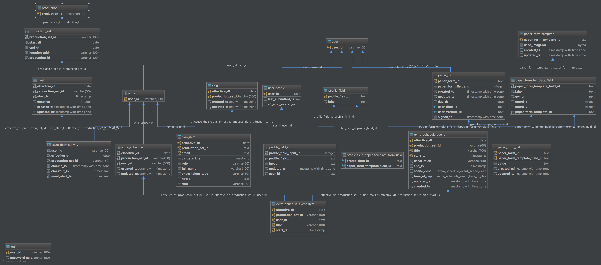

# wrapid-db



## API

### Queries

#### Get daily skin
*name: * get_daily_skin(p_effective_dt DATE)

*RETURNS TABLE*
(effective_dt DATE,
  email VARCHAR(100)
  , first_name VARCHAR(100)
  , last_name VARCHAR(100)
  , call_start_ts TIMESTAMP
  , role VARCHAR(50)
  , pay VARCHAR(50
))

```
SELECT
  effective_dt,
  email,
  first_name,
  last_name,
  call_start_ts,
  role,
  pay
FROM get_daily_skin('2017-03-20');
```

#### Get User Profile Picture
get_user_profile_photo -> (user_id TEXT) -> BYTEA
```
SELECT * FROM get_user_profile_photo('test@fake.com');
```

#### Get Extra profile

get_extra_profile -> (user_id: TEXT) -> TABLE()
```
SELECT * FROM get_extra_profile('test@email.com');
```

#### Get Extra Form from Mapped Profile

map_extra_profile_fields -> (user_id: TEXT) -> TABLE()
```
SELECT * FROM map_extra_profile_fields('test@email.com');
```


#### Get extra schedule
*get_extra_schedule*
*PARAMS:*
p_effective_dt DATE, p_user_id VARCHAR(100)

*RETURNS*
RETURNS TABLE(
    effective_dt DATE,
    production_set_id VARCHAR(50),
    user_id TEXT,
    title VARCHAR(100),
    description VARCHAR(100),
    start_ts TIMESTAMP WITHOUT TIME ZONE,
    end_ts TIMESTAMP WITHOUT TIME ZONE,
    scene_desc extra_schedule_event_scene_desc,
    time_of_day extra_schedule_event_time_of_day
  )

```
SELECT * FROM get_extra_schedule('2017-03-21', 'test@fake.com');  

```

### Mutations

#### Add Extra Schedule Event
*add_extra_schedule_event*
**Notes: Will insert a new schedule for event if no schedule exists for this event**
*PARAMETERS*
(p_effective_dt DATE,
    p_production_set_id VARCHAR(50),
    p_user_id TEXT,
    p_title VARCHAR(100),
    p_description VARCHAR(100),
    p_start_ts TIMESTAMP WITH TIME ZONE,
    p_end_ts TIMESTAMP WITH TIME ZONE,
    p_scene_desc extra_schedule_event_scene_desc,
    p_time_of_day extra_schedule_event_time_of_day
  )
*RETURN*
TEXT ('SUCCESS')

```
SELECT * FROM
  add_extra_schedule_event
  ('2017-03-21'
  , 'RunaBetterSet'
  , 'test@fake.com'
  , 'Scene 1'
  , 'Act nicely'
  , to_timestamp('10:00', 'HH24:MI')
  , to_timestamp('13:00', 'HH24:MI')
  , 'INTERIOR'
  , 'DAY');
```


#### Set User Profile Photo
set_user_profile_photo -> (p_user_id: TEXT, p_b64_image BYTEA) -> VARCHAR(500)

```
SELECT * FROM set_user_profile_photo('test@fake.com', 'http://samples3url...');
```

#### Upload Skin
upload_skin(p_effective_dt DATE, p_production_set_id VARCHAR(100), p_skin_items TEXT )

*PARAMETERS*
p_skin_items is a comma separated row of each skin item, where rows are separated by semicolons
p_skin_items = '<email>,<first_name>,<last_name>,<callStartHH>,<callEndHH>,<role>,<pay>;......'

RETURNS TABLE(unregistered_extras VARCHAR(100)

```
SELECT * FROM upload_skin('2017-03-21', 'RunaBetterSet', 'j@fake.com,john,smith,08,30,cop,88/12;sa@fake.com,sally,miller,08,30,cop,88/12');
```

####  Register extra
Adds extra as user and fills out some of profile fields (first name, last name)

register_extra: (user_id: TEXT, password_salt: TEXT, first_name: TEXT, last_name: TEXT) -> TABLE(user_id, profile_field_id, input)
```
SELECT user_id, profile_field_id, input) FROM register_extra('theraccoun@gmail.com', 'wrapid', 'Steven', 'MacCoun', 'J');
```
